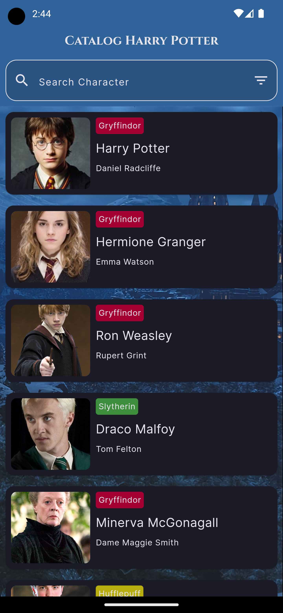
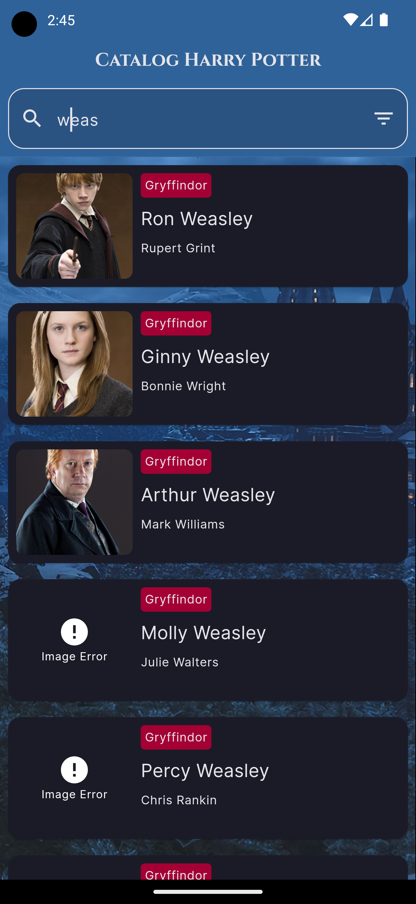
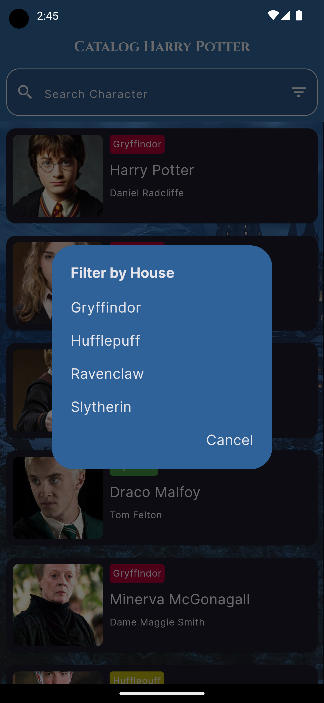
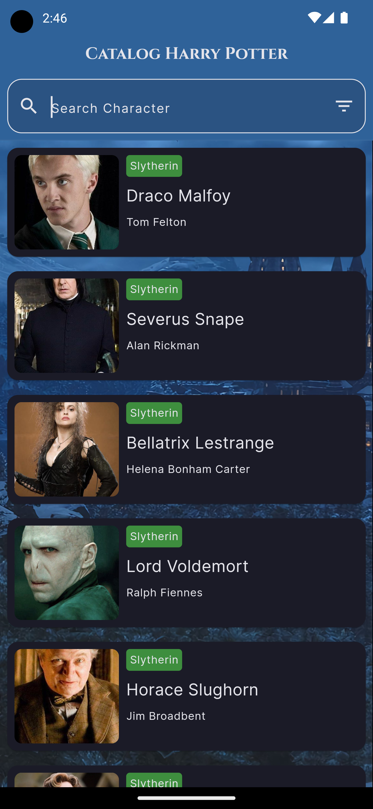
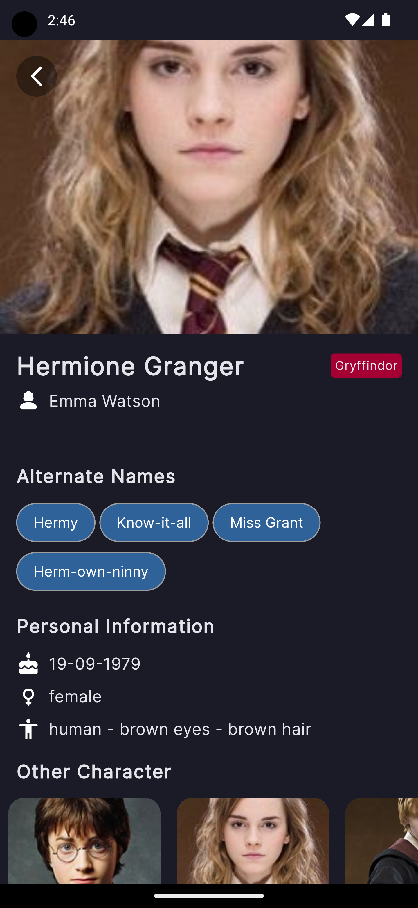
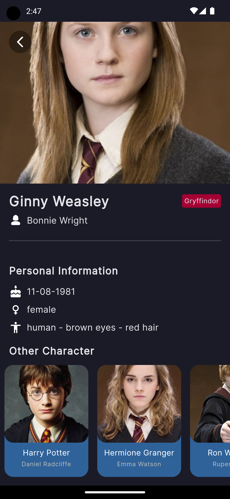

## Flutter Catalog Harry Potter
- getX
- Dio
- MVC

## ScreenShots
| List Data        |  Search Data   |
|--------------|-----------|
|  |       |
| Filter Dialog        |  Filter List   |
|  |       |
| Detail Data        |  Detail Data   |
|  |       |

## Credits
- Image Background [Enter Post](https://x.com/Enter_Apps/status/1823460872716693926?t=6pLXOm_K-1HzJPU4B24cPg&s=19)
- data Catalog [Enter Web](https://hp-api.onrender.com/)
